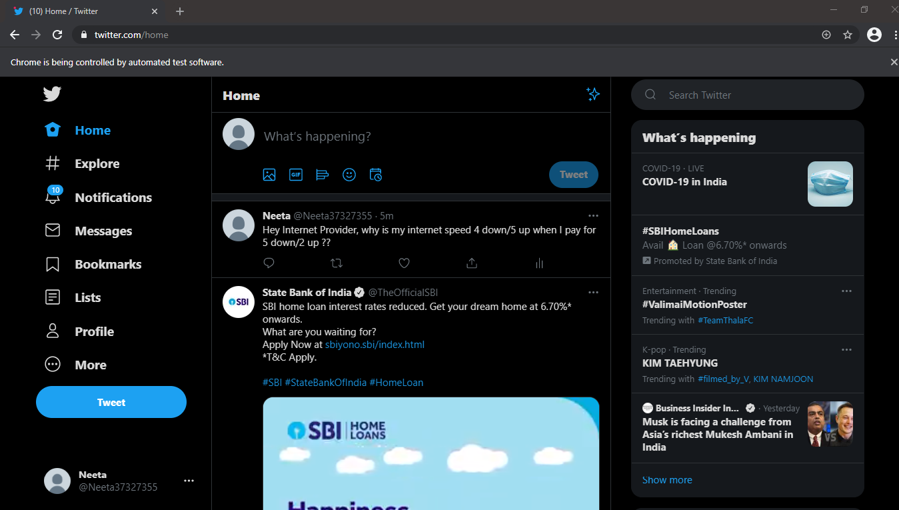

# Auto-Twitter-Complaint-Bot
This project is a simple aotomated complaint bot programming. This bot checks our internet servives like download speed and our upload speed. After checking our internet services, it checks whether the internet service is upto the services they have assured us. If it is not then, it will send tweet to the internet service provider to their twitter account automatically. It will automatically checks the internet services and send the complaint using Selenium Webdrivers.

## Technologies
- Python
- Selenium
- Chrome Webdrivers
- Requests

## Preview

**Speed Testing Preview**

**Sending Tweet Preview**
